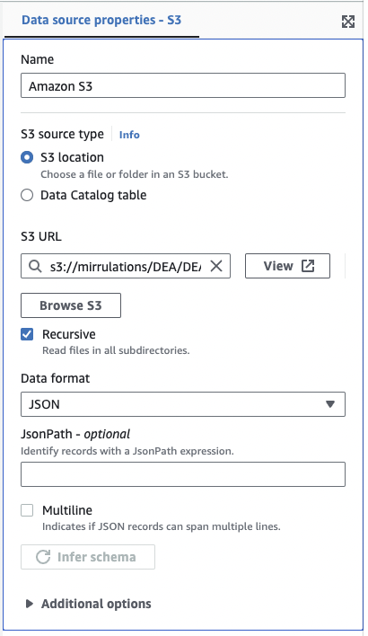
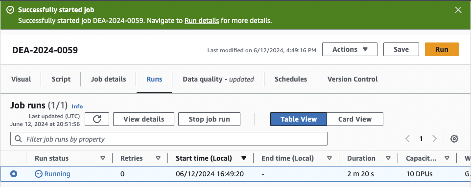
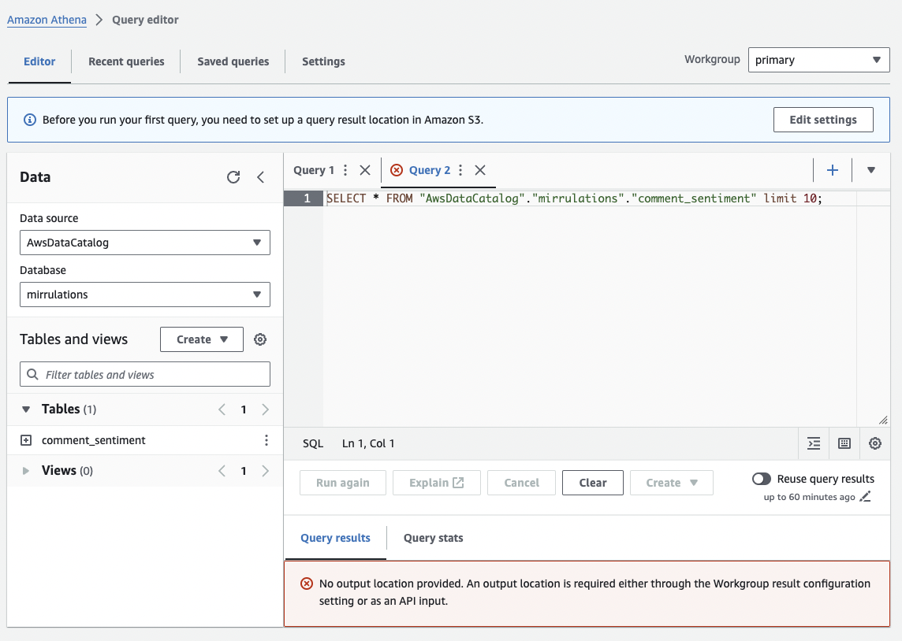
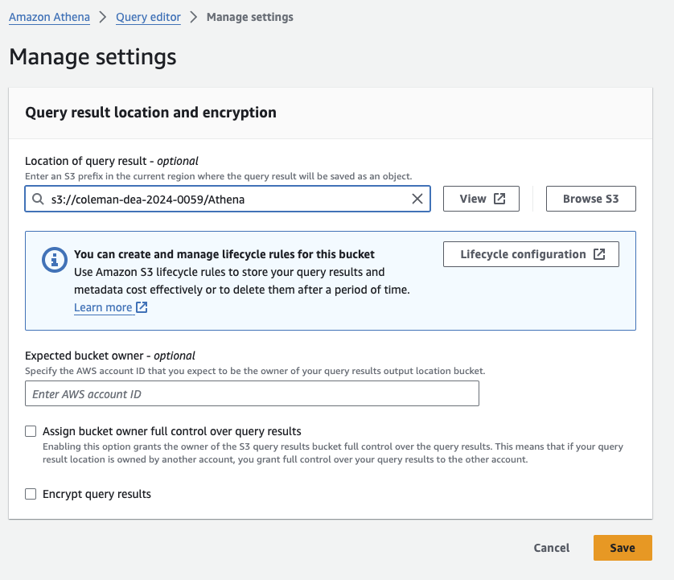
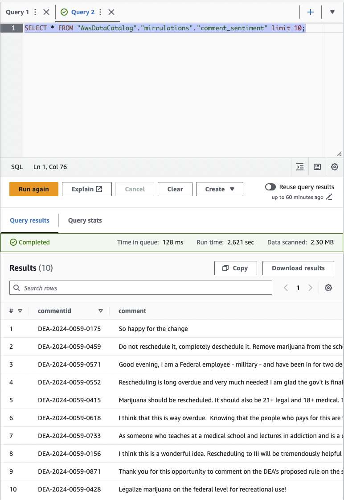
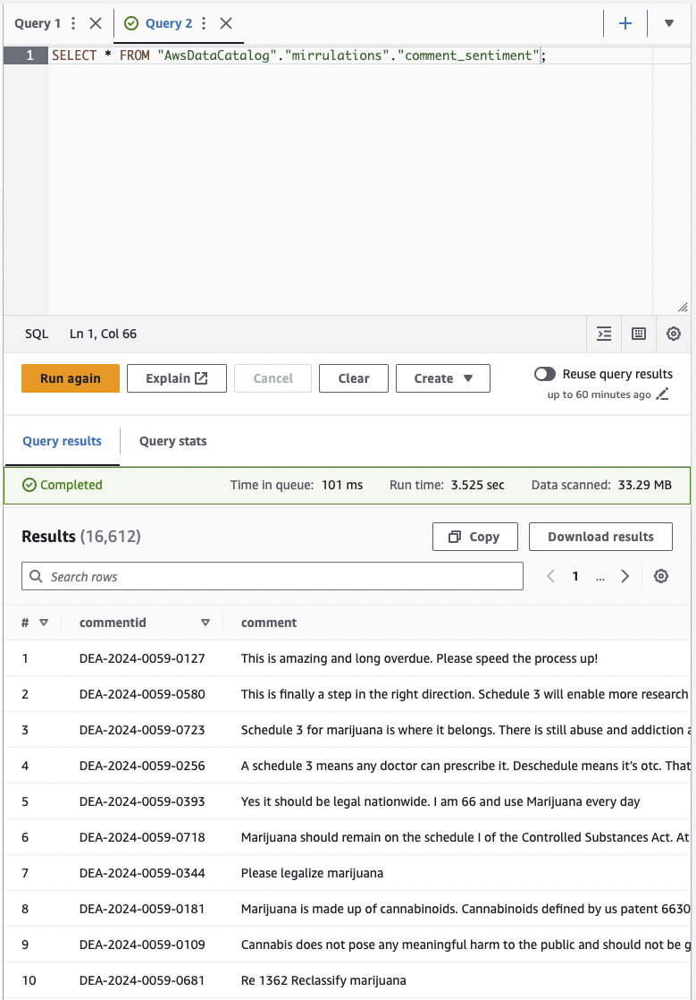

# Extracting Comment Sentiment from Public Comments

## Overview

The [regulations.gov](https://www.regulations.gov/) website allows users to view proposed rules and supporting documents for the federal rule-making process.  As of 2024, the site contains about 27 million pieces of text and binary data that is valuable for data journalism.  As a public record of the rule-making process, it contains insights into the workings of federal agencies.  

[Mirrulations (MIRRor of regULATIONS.gov)](https://github.com/MoravianUniversity/mirrulations) is a system to create a mirror of the data, and all this data is available in the [mirrulations S3 bucket](https://mirrulations.s3.amazonaws.com/).  In this tutorial you will consider a single docket (proposed rule).  You will use [AWS Glue](https://aws.amazon.com/glue/) and [AWS Comprehend](https://aws.amazon.com/comprehend/) to extract the text of the public comments on this docket and perform sentiment analysis on that text.

## Prerequisites

This tutorial assumes basic familiarity with AWS S3, AWS Glue, and AWS Athena.  Each step will provide instructions on how to configure each service and provide relevant screenshots - but detailed explanation of the configuration options is not provided.

## Tutorial Data

In 2024, the DEA [proposed to transfer marijuana from schedule I of the Controlled Substances Act (“CSA”) to schedule III of the CSA.](https://apnews.com/article/marijuana-biden-dea-criminal-justice-pot-f833a8dae6ceb31a8658a5d65832a3b8).  The docket, [`DEA-2024-0059`](https://www.regulations.gov/docket/DEA-2024-0059) contains the proposed rule as well as the tens of thousands of public comments that were submitted.


The `mirrulations` data is stored in a [hierarchical structure](https://github.com/MoravianUniversity/mirrulations/blob/main/docs/structure.md):

```
<agency>
└── <docket id>
    ├── binary-<docket id>
    │   ├── comments_attachments
    │   │   ├── <comment id>_attachement_<counter>.<extension>
    │   │   └── ...
    │   ├── documents_attachments
    │   │   ├── <document id>_attachement_<counter>.<extension>
    │   │   └── ...
    └── text-<docket id>
        ├── comments
        │   ├── <comment id>.json
        │   └── ...
        ├── comments_extracted_text
        │   ├── <tool name>
        │   |   ├── <comment id>_attachment_<counter>_extracted.txt
        │   |   └── ...
        |   └─ ... <other tools>
        ├── docket
        │   ├── <docket id>.json
        |   └── ...
        ├── documents
        │   ├── <document id>.json
        │   ├── <document id>_content.htm
        │   └── ...
        └── documents_extracted_text
            ├── <tool name>
            |   ├── <document id>_content_extracted.txt
            |   └── ...
            └─ ... <other tools>
```

The files we want are in `DEA/DEA-2024-0059/text-DEA-2024-0059/comments`.


Each comment file contains JSON data with the following format (extraneous fields omitted for clarity):


```
{
    "data": {
        "id": "DEA-2024-0059-0008",
        "type": "comments",
        "attributes": {
            "comment": "<Comment text here>"
            "modifyDate": "2024-05-21T14:17:51Z",
        }
    }
}


```

### AWS S3 Bucket

While the data will be pulled from the `mirrulations` S3 bucket, Glue and Athena use S3 to store results.  In this step you will create a bucket to hold these results.

* In S3, create a bucket to hold Glue and Athena results.  Remember, bucket names are globally unique, so we recommend using something like your lastname followed by `dea-2024-0059` (the docket ID).


### AWS Glue Database

We will store our results in an AWS Glue Database so we can access it using AWS Athena.

* In the AWS Glue Dashboard under "Data Catalog" select "Databases" and then click "Add database."
  * Name the database "mirrulations" and leave all other options their default value.

## AWS Glue ETL

We will use AWS Glue to extract the comments from the `DEA-2024-0059` docket, transform that data into a table containing the comment/sentiment analysis, and store the result in a database that AWS Athena can query.

* In the AWS Glue dashboard under "ETL Jobs" select "Visual ETL" and then click "Visual ETL" to create a new job.  Name the job "DEA-2024-0059."

* In the "Add Nodes" panel under "Sources," add an "Amazon S3" node

  

* Configure the node to use the data from the `mirrulations` bucket

  
  
  Set the S3 URL to `s3://mirrulations/DEA/DEA-2024-0059/text-DEA-2024-0059/comments`.
  
  Set the "Data Format" to "JSON."

* Add a "Change Schema" transform node

  

* Configure this node to remove all nodes *except* `data.id`, `data.attributes.comment`, and `data.attributes.modifydate`.

  

* Add a "RenameField" transform node:

  
  
* Configure this node to change `data.id` to `commentID`

  
  
* Add similar "RenameField" nodes for the Comment and Modify Date

  * Rename `data.attributes.comment` to be `comment`
  * Rename `data.attributes.modifyDate` to be `modifyDate`
  
* Add a "Custom code" transform:

  
  
* Name the node "HTMLtoText" and add the following as the "Code Block":

  ```
  def HTMLToText (glueContext, dfc) -> DynamicFrameCollection:
    
      from html.parser import HTMLParser
      class HTMLFilter(HTMLParser):
          def __init__(self):
              super().__init__()
              self.text = ''
                
          def handle_data(self, data):
              self.text += data + ' '
     
    
      from pyspark.sql.functions import udf
      @udf        
      def convert(comment):
          filter = HTMLFilter()
          filter.feed(comment)
          return filter.text
    
      df = dfc.select(list(dfc.keys())[0]).toDF()
      df_filtered = df.withColumn("comment", convert("comment"))
      dyf_filtered = DynamicFrame.fromDF(df_filtered, glueContext, "html_to_text")
      return(DynamicFrameCollection({"CustomTransform0": dyf_filtered}, glueContext))
  ```      

  This code uses Python's built-in `HTMLParser` to remove any HTML tags, leaving us with just the text of the comment.
  
* Add a "SelectFromCollection" transform:

  
  
* Use the default configuration for this node:

  
  
* Add a "Custom code" transform:

  
  
* Name the node "Sentiment Analysis" and add the following as the "Code Block":
 
  ```
  def SentimentAnalysis (glueContext, dfc) -> DynamicFrameCollection:
    
      from pyspark.sql.functions import udf
      @udf        
      def convert(comment):
        
          import textwrap
          comment = textwrap.wrap(comment, 5000, break_long_words=False)[0]
        
          import boto3
          AWS_REGION = 'us-east-1'
          client = boto3.client('comprehend',region_name = AWS_REGION)
          result = client.detect_sentiment(Text=comment, LanguageCode='en')
          return result['Sentiment']
    
      df = dfc.select(list(dfc.keys())[0]).toDF()
      df_filtered = df.withColumn("sentiment", convert("comment"))
      dyf_filtered = DynamicFrame.fromDF(df_filtered, glueContext, "sentiment_analysis")
      return(DynamicFrameCollection({"CustomTransform0": dyf_filtered}, glueContext))
  ```

* Add a "SelectFromCollection" transform:

  
  
* Use the default configuration for this node:

  
  

* Add a "S3 bucket" from the "Targets" menu

  
  
* Configure this node to save the data as JSON in your S3 bucket:

  * Format: JSON
  * Compression Type: None
  * S3 Target Location: The bucket you created
  * Data Catalog update options: Create a table in the Data Catalog and on subsequent runs, update the schema and add new partitions
  * Database: `mirrulations`
  * Table name: `comment_sentiment`


## Run Your ETL Job

* Save the Visual ETL and then click "Run"
* Click "Run Details" in the green bar at the top of the window to see the progress.
* Wait until the "Run Status" is "Complete" before continuing to the next step (5 to 10 minutes).

  

## View the Data

* In the AWS Glue dashboard under "Data Catalog" select "Tables"
* In the row for `comment_seniment` select "Table data."  Select "Proceed" when prompted to go to Athena.

  
  
* At the top of the Athena page select "FIXME" to configure where Athena stores results.

  
  
* In the page that opens, navigate to the "Athena" folder in the S3 bucket you created.

  
  
* Click on "Run Query" to generate 10 results

  


## Export Results to CSV

* Remove `limit 10` from the end of the query and click "Run again"
* Click on "Download results" to download a CSV file containing `commentId`, `comment`, `modifydate`, and `sentiment`.

  


## References

* [How to scale sentiment analysis using Amazon Comprehend, AWS Glue and Amazon Athena](https://aws.amazon.com/blogs/machine-learning/how-to-scale-sentiment-analysis-using-amazon-comprehend-aws-glue-and-amazon-athena/)
* [Tutorial: Analyzing insights from customer reviews with Amazon Comprehend](https://docs.aws.amazon.com/comprehend/latest/dg/tutorial-reviews.html)
* [Simplify data discovery for business users by adding data descriptions in the AWS Glue Data Catalog](https://aws.amazon.com/blogs/big-data/simplify-data-discovery-for-business-users-by-adding-data-descriptions-in-the-aws-glue-data-catalog/)